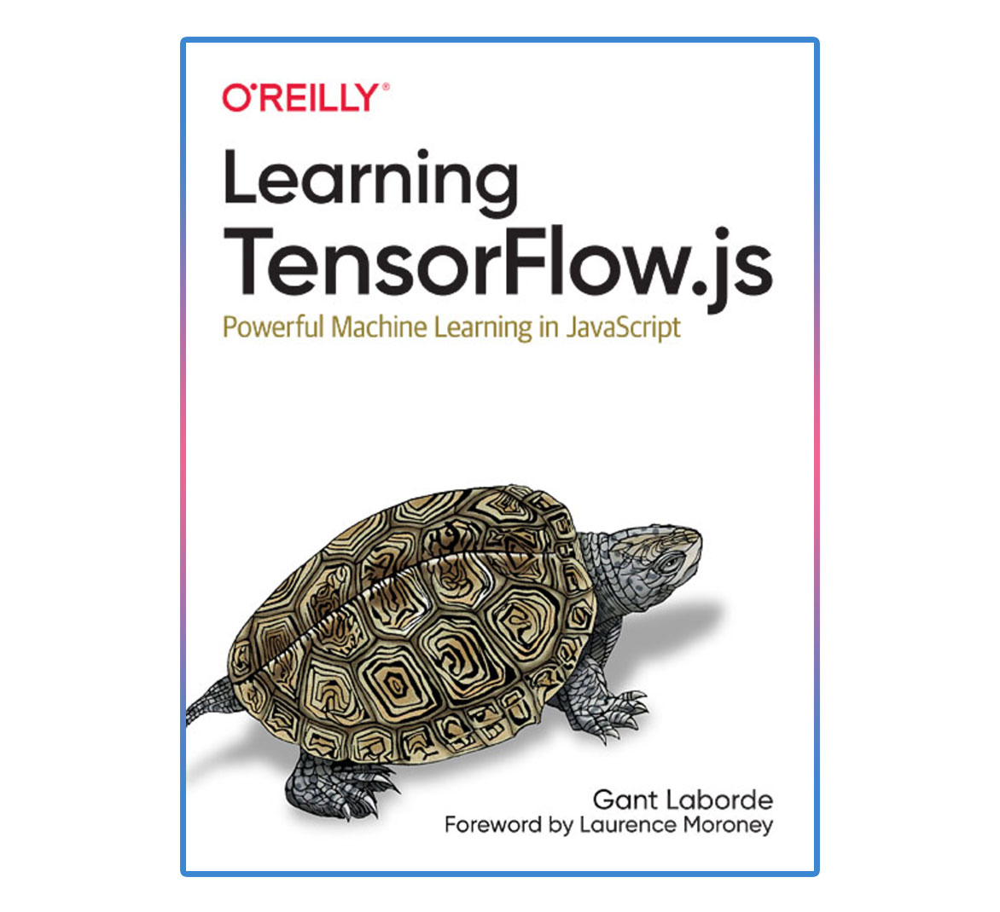

# Source for O'Reilly's Learning TensorFlow.js Book

Learning TensorFlow.js - Powerful Machine Learning in JavaScript by Gant Laborde

### About the Book

Learn how to take advantage of the TensorFlow.js framework to implement machine learning models in the client browser or server.

#### This book is intended for two audiences:

- Web devs and Front end Engineers who are familiar with JavaScript but unfamiliar with how to get started in AI / ML.
- Experienced AI specialists who are interested in how to apply their server-based skills to a framework like TensorFlow.js.

Purchase your copy of the book on Amazon: https://amzn.to/3dR3vpY

### About the Code

The code in this repository is broken down by chapter. Each chapter folder has a technical domain split. Some code is repeated in each folder for each technology.

The folders in each chapter could be:

- `extra` - any extra content for that chapter that is not technically specific.
- `node` - A Node.js set of solutions and code for the given chapter that run as a server.
- `simple` - A "inline" hosted set of HTML solutions in code for a given chapter that run in the browser. These files do not depend on a package management system for hosting. These files access their dependencies via CDNs.
- `web` - A Parcel.js web hosted solution of code that runs using NPM to create a browser based solution. These projects reflect modern transpiled web technology.

### Book Chapters

- **Chapter 1** _AI is Magic_ - There is no code associated with Chapter 1 because it's an introduction to the book and concepts.
- **Chapter 2** _Introducing TensorFlow.js_ - This chapter is focused on getting you running TensorFlow.js on a client or a server. Once you've got it running, you actually run a Toxicity classifier on given text.
- **Chapter 3** _Introducing Tensors_ - This chapter helps you understand the concept and need of tensors. You then immediately use this technology to build a simple recommendation system for music.
- **Chapter 4** _Image Tensors_ - Images in machine learning are a fantastic example of tensors and all the things you can do to modify complex data.
- **Chapter 5** _Introducing Models_ - Learn what makes an AI tick. Machine learning models are the core of what drives machine learning. In this chapter, you implement several models.
- **Chapter 6** _Advanced Models & UI_ - In this chapter, you implement a very advanced model that detects objects, you then do an overlay that helps illustrate the results, and you connect everything to the webcam for real-time inference.
- **Chapter 7** _Model Making Resources_ - Now that you understand how to implement models, where do they come from? This chapter gives you a tour of conversion commands and data resources.
- **Chapter 8** _Training Models_ - Train your first model from data. See the simplest model architecture for the simplest problem. You train directly in the browser!
- **Chapter 9** _Classification Models & Data Analysis_ - Data isn't always clean. Learn how to build a notebook, visualize, and extract features from your data by solving who would survive the Titanic.
- **Chapter 10** _Image Training_ - Bring in some advanced concepts for feature extraction via convolutions. Understand and learn how to build more advanced models on Node.js and implement those models in the browser.
- **Chapter 11** _Transfer Learning_ - Learn what transfer learning is and utilize it. Transfer learn with a several methods and see the benefit with small datasets.
- **Chapter 12** _Dicify - Capstone Project_ - Utilize all the skills you've learned. Compose a dataset and train a model to create art out of dice.
